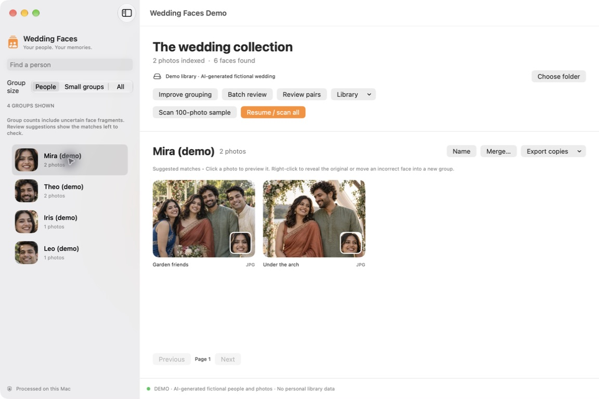

<p align="center"></p>

<p align="center"><strong>Find your people. Keep your photos on your Mac.</strong><br>Local face grouping for photo collections on your Mac or external drive.</p>

<p align="center"><a href="#quick-start">Get started</a> · <a href="#what-it-does">Features</a> · <a href="#privacy">Privacy</a> · <a href="docs/ROADMAP.md">Roadmap</a> · <a href="CONTRIBUTING.md">Contribute</a></p>

> **Early source beta** · macOS · JPG + Sony ARW · Human review required

## The story

I got married. Then came a drive full of photos—and a surprisingly hard question:

**“How do I find every photo of each person?”**

Wedding Faces started there. Point it at a folder, let it suggest face groups, review the matches, and export copies for the people you care about. Useful for wedding collections, family archives, and the photo folders you've been meaning to organize.

## See it in action

**Real app interface, fictional demo collection.** These screenshots use AI-generated people and photos with manually reviewed groups. No private photo-library data is shown; this is an interface demonstration, not an accuracy benchmark.

### Browse photos by person



<details>
<summary><strong>Preview a photo without leaving the app</strong></summary>


</details>

[Download and reuse the demo screenshots](docs/screenshots/README.md) with their demo disclosure.

## What it does

| Your collection | What Wedding Faces helps with |
| --- | --- |
| Thousands of images across folders | Scan recursively, including external drives |
| JPG and RAW versions of the same shot | Pair JPG + ARW by filename within each folder |
| The same person in many photos | Suggest face groups with local recognition |
| One person split into several groups | Review pairs or batches, select all for the current person, and track remaining counts |
| Suggestions that need correction | Save skip / different-person decisions and name groups |
| Photos you want to share | Export copies while leaving originals untouched |

### A small workflow for a large collection


**No account. No photo uploads. No subscription service.** Dependencies and public models download during setup; the application processes your photos locally afterward.

## Quick start

[Full installation guide and verified Beta 2 test results](docs/INSTALLATION.md).

Requires macOS 14 or later, Python 3.12, and Apple's Command Line Tools (`xcode-select --install`). Apple Silicon is the development target; other configurations have not been validated.

```sh
git clone https://github.com/Amankumar2010/wedding-faces.git
cd wedding-faces
bash scripts/setup.sh
open 'Wedding Faces Beta.app'
```

Setup downloads Python dependencies and checksum-verified OpenCV models. Keep the app beside the source files, `.venv`, and `models` directory. This is a source-based beta, not a standalone, notarized download or Mac App Store release.

Choose your photo folder, try the 100-photo sample, then scan the collection. If the sidebar looks empty despite detected faces, choose **All** or **Small groups**; **People** hides unnamed groups with fewer than five photos. Use Improve grouping, Batch review, or Review pairs to correct suggestions. Recognition is imperfect: lighting, profiles, blur, and small faces can split one person into many groups. Review before exporting. This release uses SFace only; experimental research models are not included.

## Privacy

The application code has no photo-upload, analytics, or telemetry feature. Recognition runs locally after setup. The local `Library/` folder contains sensitive thumbnails, face embeddings, names, source paths, review decisions, logs, and backups. It is not encrypted by this app. Protect it like your original photos; avoid cloud-synced folders if you want to keep all copies off cloud services.

Never share `Library/`, screenshots containing private photos or names, exports, or a zipped working app folder. Use the explicit source-only packaging script described below. Exports preserve original file contents, including any embedded metadata such as location or camera details.

## Development and source packaging

```sh
.venv/bin/python -m unittest discover -s tests
python3 scripts/package_source.py
```

The packager accepts only checksum-pinned demo screenshots and reviewed source paths in `PUBLIC_FILES.json`, rejects symlinks and sensitive file types, and produces a source archive outside this folder. Re-run it after any change; an allowlist limits which files ship but is not a substitute for reviewing their contents.

## Limitations

If macOS asks for Documents or removable-drive access, allow it for the app when needed to read your selected collection and local installation.

One photo folder per catalog. No iPad app, cloud sync, or automatic drive relocation. Photos without detected faces are indexed but not shown in person groups. Automatic grouping is conservative, not guaranteed accurate. Library size grows with thumbnails and face data. Stop scanning before editing groups.

## Licenses

Application code: MIT. OpenCV SFace model: Apache 2.0. YuNet model: MIT. Their license texts are in `models/`; model weights are downloaded separately. Python dependencies retain their own licenses. No personal catalog, private photographs, or research-only model weights are distributed. Demo screenshot provenance is documented in `docs/screenshots/README.md`.

## Help shape the next version

Try a small collection first, then tell us where the workflow gets in your way. Useful feedback beats inflated accuracy claims.

- [Report a bug](https://github.com/Amankumar2010/wedding-faces/issues/new?template=bug_report.md) without private photos, names, or paths.
- [Suggest a feature](https://github.com/Amankumar2010/wedding-faces/issues/new?template=feature_request.md).
- Star the repository if you'd like to follow its development.

Built for a personal problem. Shared for anyone with the same one.
